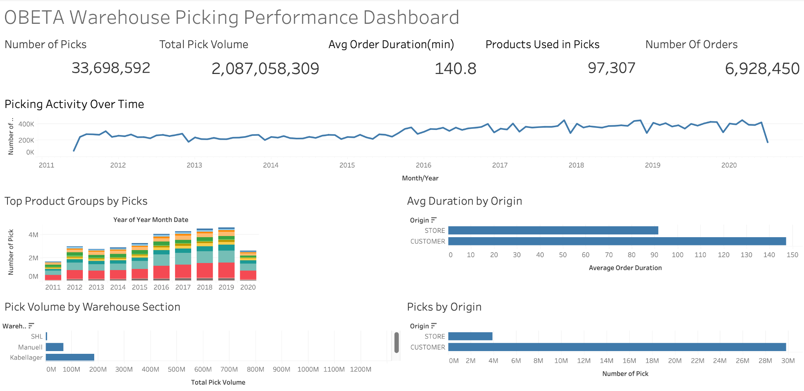
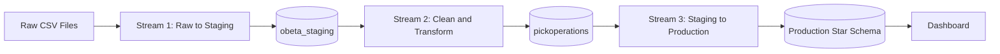

# OBETA Warehouse Picking Performance Dashboard

> Documentation repository for the OBETA case study dashboard, ETL methodology, production data model, KPIs, SQL queries, and presentation explanation.



> **Mermaid note:** If you open the `.md` files as plain text, you will see the Mermaid code block. The diagram renders only in Markdown viewers that support Mermaid, such as **GitHub**, **GitLab**, **Obsidian**, or **VS Code Markdown Preview** with Mermaid support. I also added the raw Mermaid source files in `assets/*.mmd` for easy copy/paste.

---

## Start Here

This repository is designed so that users can open this first `README.md` and navigate through the whole project.

| Section | Open | Purpose |
|---|---|---|
| Project context | [01. Project Overview](docs/01-project-overview.md) | Understand what the dashboard analyzes and why |
| Data model | [02. Data Model](docs/02-data-model.md) | Review the OBETA star schema: `pick`, `product`, and `order` |
| KPIs | [03. Dashboard KPIs](docs/03-dashboard-kpis.md) | Understand each KPI, its calculation, and its meaning |
| Charts | [04. Dashboard Charts](docs/04-dashboard-charts.md) | Understand each visualization and what question it answers |
| Presentation | [05. Presentation Script](docs/05-presentation-script.md) | Use a ready-to-speak explanation for class |
| Improvements | [06. Remarks and Improvements](docs/06-remarks-suggestions-improvements.md) | See limitations and suggested improvements |
| Schema | [07. Database Schema Reference](docs/07-database-schema-reference.md) | Review full staging and production DDL |
| Methodology | [08. Staging / Production Methodology](docs/08-staging-production-methodology.md) | Learn how staging/prod was used, why it works, and pros/cons |
| Methodology diagram | [09. Staging / Production Diagram](docs/09-staging-production-diagram.md) | View Mermaid diagrams for the ETL architecture |
| ER diagram | [10. Production ER Diagram](docs/10-production-er-diagram.md) | View the Mermaid ER diagram for the final production model |
| SQL queries | [Dashboard KPI Queries](sql/dashboard-kpi-queries.sql) | See the SQL used for dashboard KPIs |
| Database DDL | [Database Schema SQL](sql/database-schema.sql) | See the SQL schema definitions |

---

## Executive Summary

The OBETA dashboard analyzes warehouse picking performance. The data was processed through a staged ETL architecture and then modeled into a production **star schema**.

```text
Raw CSV files → obeta_staging → cleaned pickoperations → obeta_production star schema → dashboard
```

The final analytical model contains:

| Table | Type | Role |
|---|---|---|
| `obeta_production.pick` | Fact table | Stores picking operations, measurable values, and time fields |
| `obeta_production.product` | Dimension table | Stores product context such as group, description, and warehouse section |
| `obeta_production.order` | Dimension table | Stores order context such as origin and position in order |

---

## Main Dashboard KPIs

| KPI | Calculation | Meaning |
|---|---|---|
| Number of Picks | `COUNT(pick_id)` | Total picking operations |
| Total Pick Volume | `SUM(pick_volume)` | Total volume handled in the warehouse |
| Average Order Duration | `AVG(order_duration)` | Average time needed to complete an order |
| Products Used in Picks | `COUNT(DISTINCT product_key)` | Unique products involved in picks |
| Number of Orders | `COUNT(DISTINCT order_key)` | Unique orders processed |

---

## Dashboard Questions Answered

The dashboard helps answer:

- How many picking operations were performed?
- How much total volume was picked?
- How long does an average order take to complete?
- Which product groups generate the most picking workload?
- Which warehouse sections handle the highest volume?
- Are customer or store orders slower to process?
- How did picking activity evolve over time?

---

## Methodology Overview



The staging/production methodology works because it separates responsibilities:

| Layer | Responsibility |
|---|---|
| Raw/Staging input | Preserve and load source data |
| Clean staging | Clean, enrich, join, and calculate fields |
| Production | Store the final analytics-ready star schema |
| Dashboard | Visualize KPIs and business patterns |

---

## Repository Structure

```text
obeta-dashboard-documentation/
├── README.md
├── docs/
│   ├── 01-project-overview.md
│   ├── 02-data-model.md
│   ├── 03-dashboard-kpis.md
│   ├── 04-dashboard-charts.md
│   ├── 05-presentation-script.md
│   ├── 06-remarks-suggestions-improvements.md
│   ├── 07-database-schema-reference.md
│   ├── 08-staging-production-methodology.md
│   ├── 09-staging-production-diagram.md
│   └── 10-production-er-diagram.md
├── sql/
│   ├── dashboard-kpi-queries.sql
│   └── database-schema.sql
└── assets/
    ├── dashboard-overview.png
    ├── staging-production-methodology.mmd
    └── production-er-diagram.mmd
```

---

## Recommended Reading Path

1. [Project Overview](docs/01-project-overview.md)
2. [Data Model](docs/02-data-model.md)
3. [Dashboard KPIs](docs/03-dashboard-kpis.md)
4. [Dashboard Charts](docs/04-dashboard-charts.md)
5. [Staging / Production Methodology](docs/08-staging-production-methodology.md)
6. [Staging / Production Diagram](docs/09-staging-production-diagram.md)
7. [Production ER Diagram](docs/10-production-er-diagram.md)
8. [Presentation Script](docs/05-presentation-script.md)

---

## Short Presentation Summary

The dashboard uses the OBETA production star schema. The `pick` table is the fact table and stores the measurable picking operations. The `product` and `order` tables are dimensions that provide business context.

The selected KPIs summarize total activity, handled volume, order processing efficiency, product variety, and order demand. The charts then break these KPIs down by time, product group, order origin, and warehouse section.

The staging/production approach makes the process easier to debug, more reproducible, and better prepared for analytics.
