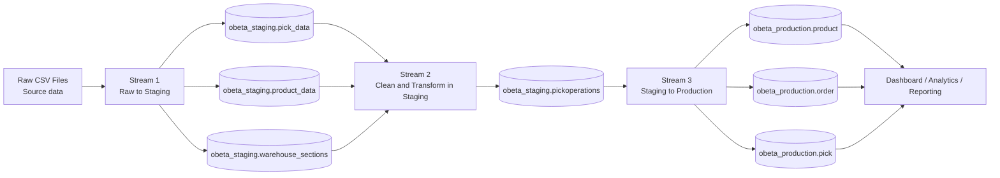
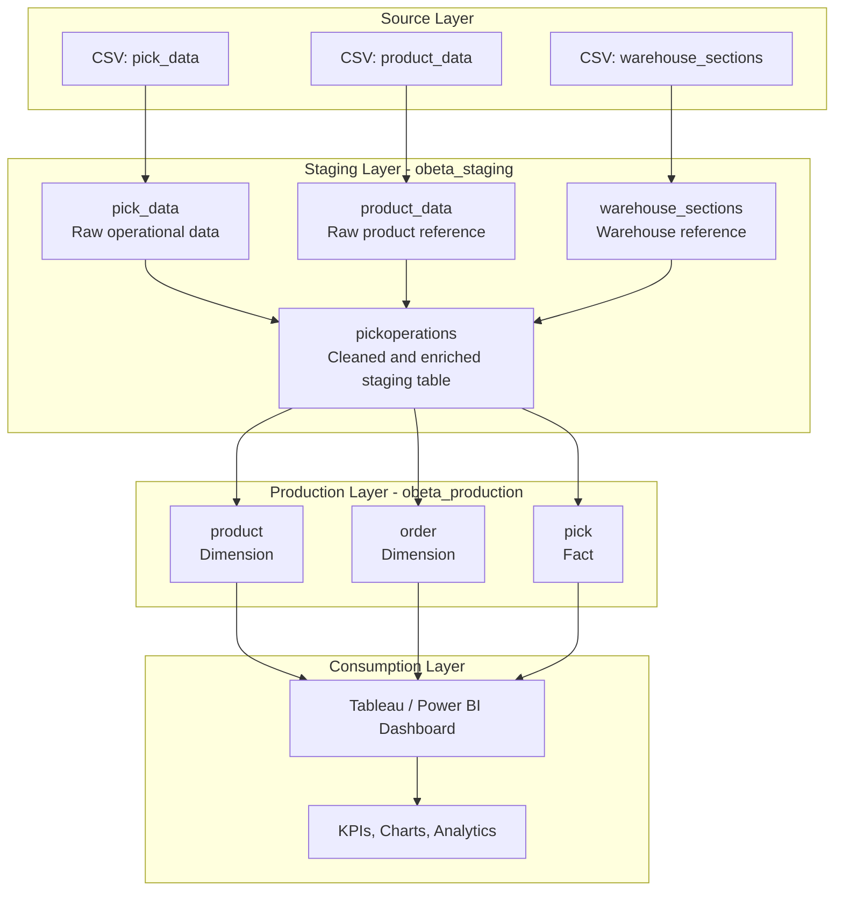

# 09. Staging / Production Methodology Diagram

This document contains a **Mermaid diagram** that shows how the **staging/production methodology** works in the OBETA project.

---

> **Rendering note:** Mermaid diagrams render only in compatible Markdown viewers such as **GitHub** or **VS Code Markdown Preview**. If you only see code, open this file on GitHub or use the raw Mermaid source file: [../assets/staging-production-methodology.mmd](../assets/staging-production-methodology.mmd).

## 1. High-Level Methodology Diagram

---

## 2. Layer-by-Layer Responsibility Diagram

---

## 3. What the diagram shows

- **Source files** are the starting point.
- **Stream 1** loads raw files into the `obeta_staging` database.
- **Stream 2** cleans, enriches, and transforms the raw staging data into `pickoperations`.
- **Stream 3** converts the cleaned staging output into the final **production star schema**.
- The dashboard reads from the **production layer**, not from the raw staging tables.

This is the core idea of the methodology: **prepare first, analyze later**.

---

## 4. Why the diagram matters

The diagram helps explain that the project is not just a dashboard. It is a complete mini data warehouse process:

1. **Ingest raw data**
2. **Stage and clean data**
3. **Model it for analytics**
4. **Use the final model for reporting**

This is why the methodology is robust, explainable, and closer to real-world BI and data engineering practice.

---

## Navigation

⬅️ Previous: [08. Staging / Production Methodology](08-staging-production-methodology.md)  
🏠 [Repository Home](../README.md)  
➡️ Next: [10. Production ER Diagram](10-production-er-diagram.md)
