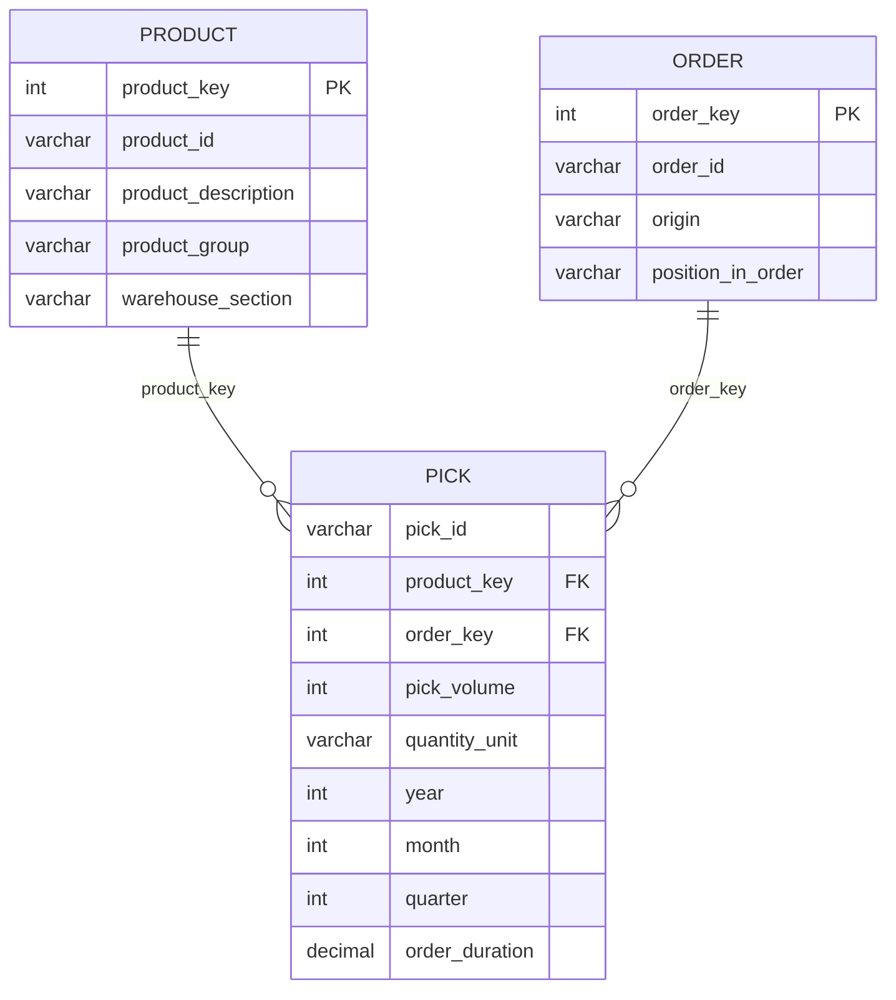

# 10. Production ER Diagram

This document contains a simplified **Mermaid ER diagram** for the OBETA production model.

The production database follows a **star schema**:

- `pick` is the fact table.
- `product` is a dimension table.
- `order` is a dimension table.
- `pick.product_key` links each pick to one product.
- `pick.order_key` links each pick to one order.

---

> **Rendering note:** Mermaid diagrams render only in compatible Markdown viewers such as **GitHub** or **VS Code Markdown Preview**. If you only see code, open this file on GitHub or use the raw Mermaid source file: [../assets/production-er-diagram.mmd](../assets/production-er-diagram.mmd).

## Mermaid ER Diagram



---

## How to explain this diagram

The production model separates **measurable warehouse activity** from **descriptive context**.

- The `pick` table stores the operational facts: each picking action, its volume, time fields, and order duration.
- The `product` table stores product information once, instead of repeating it in every pick row.
- The `order` table stores order information once, instead of repeating it in every pick row.
- The foreign keys `product_key` and `order_key` connect the fact table with the dimensions.

This structure is useful for analytics because dashboards can calculate KPIs from the fact table and group them by product or order attributes from the dimensions.

---

## Why this model is better than one huge table

A single large table would repeat product and order information millions of times. The star schema avoids part of that repetition and makes the model easier to understand, query, and visualize.

In simple terms:

```text
One big table = easier at first, but heavier and less organized.
Star schema = more structured, cleaner, and better for dashboards.
```

---

## Navigation

⬅️ Previous: [09. Staging / Production Methodology Diagram](09-staging-production-diagram.md)  
🏠 [Repository Home](../README.md)
